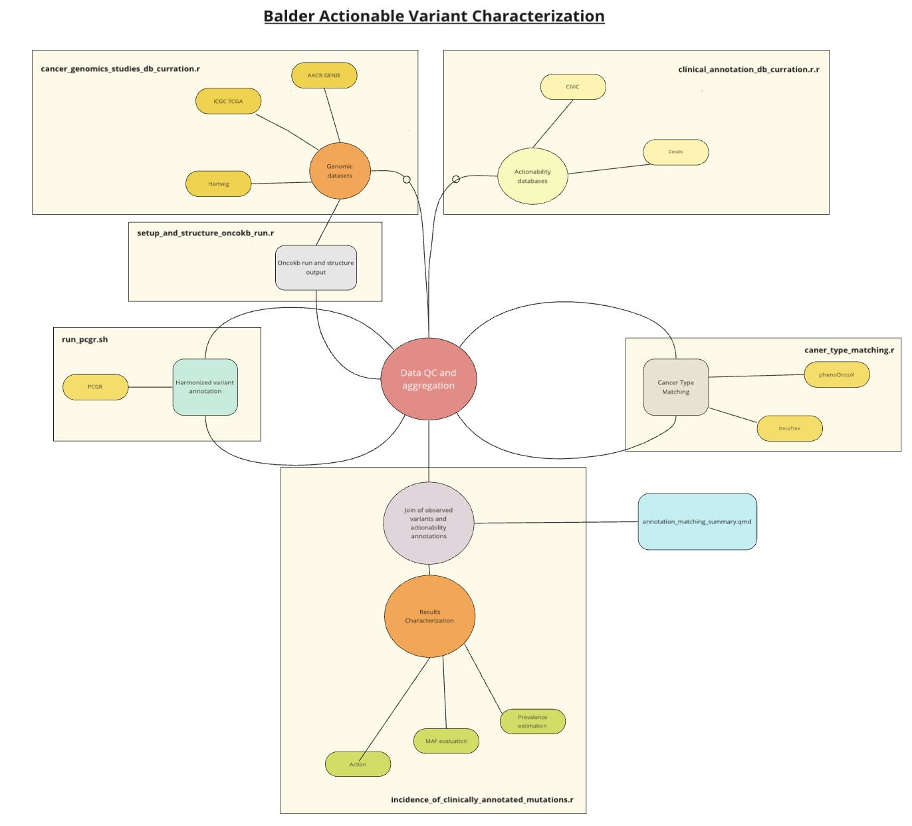

# Balder mangages tumor profile data and clinical actionability annotations
There are currently publicly available data for hundreds of thousands of tumor genomic profiles. Despite the importance of these scientific resources, there is a lack of open-source tools to harmonize and integrate somatic tumor profiles across various studies and technology types.

Balder addresses this gap by harmonizing cancer profile data and offering analysis modules to derive insights from these data. Additionally, Balder functions as a research compendium, detailing the incidence of clinically actionable biomarkers found across multiple cancer types.

## Scope 
This work utilizes lists of clinically actionable cancer biomarkers curated by the Molecular Oncology Almanac (MOA), OncoKB, and CIViC. This work examines the frequency of these biomarkers in data obtained from multiple research studies and publicly available genomic data sets.

## Running this compendia 
Figures and tables are generated by executing a Nextflow pipeline, main.nf, in the "workflow" folder. All input data is publicly available, but may require authorization or is subject to terms of use under the owning body. Additional details on the data used can be found
[here](code/reports/balder_raw_data_sources.pdf).

### workflow enviornment 
A conda enviornment specifying all required dependencies can be utilized as follows:
```
conda env create -f code/balder_conda.yml
conda activate balder_conda_env
```

After the enviornment is activated, the data processing and analysis pipeline is executed with the following command:
```
nextflow run workflow/main.nf
```

## Analysis overview 
The following schematic provides an overview of the central Balder operations including data harmonization, annotation, QC, and reporting:



## File structure
Raw data and analysis output are not stored directly in this repository. The following file structure is used: 

<pre>
|-- data                 # Directory for datasets
|   |-- raw              # Raw data, unprocessed
|   |-- processed        # Processed data, ready for analysis
|-- balder               # Documentation repo
|   |-- code             # Project code and reports
|   |   |-- R            # Utility functions
|   |   |-- report       # Result reports
|   |-- LICENSE          # License file
|   |-- README.md        # you are here
|-- output               # Analysis output (not included in git repo)
<pre>

